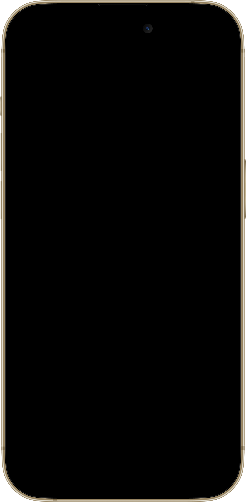

# iOS App Store Screenshots Generator (MobAI)

## Overview

Generate production-ready iOS App Store screenshots by navigating a real device via MobAI, capturing screens, and compositing them into advertisement-style layouts. Outputs a self-contained HTML page served by MobAI with one-click export at all Apple resolutions.

## Core Principle

**Screenshots are advertisements, not documentation.** Every screenshot sells one idea. If you're showing UI, you're doing it wrong — you're selling a *feeling*, an *outcome*, or killing a *pain point*.

## Step 1: Ask the User

Before doing anything, ask these questions. Do not proceed without answers.

### Required

1. **App bundle ID** — "What's the app bundle ID? (e.g., com.example.myapp)"
2. **Brand colors** — "What are your brand colors? (accent, text, background preference)"
3. **Font** — "What font for the screenshots? (Google Fonts name, e.g., Inter, SF Pro is not available)"
4. **Feature list** — "List features in priority order. What's the #1 thing your app does?"
5. **Number of slides** — "How many screenshots? (Apple allows up to 10)"
6. **Style direction** — "What style? Examples: warm/organic, dark/moody, clean/minimal, bold/colorful, gradient-heavy. Share references if you have any."

### Optional

7. **Languages** — "Want screenshots in multiple languages? Which ones? (e.g., en, de, es, ja)"
8. **iPad** — "Do you also need iPad screenshots?"
9. **Additional instructions** — "Any specific requirements?"

### Decide yourself (do NOT ask)

Based on the user's style direction and brand colors, decide:
- Background style (gradient direction, colors, light/dark)
- Decorative elements (blobs, glows, shapes, or none)
- Dark vs light slides, contrast rhythm
- Typography treatment (weight, tracking, line height)
- Color palette derivation

## Step 2: Plan the Narrative Arc

### Screenshot Framework

Adapt to the user's slide count:

| Slot | Purpose | Notes |
|------|---------|-------|
| #1 | **Hero / Main Benefit** | App icon + tagline + home screen. Most people only see this one. |
| #2 | **Differentiator** | What makes this app unique |
| #3 | **Ecosystem** | Widgets, watch, extensions. Skip if N/A. |
| #4+ | **Core Features** | One feature per slide, priority order |
| 2nd to last | **Trust Signal** | "Made for people who [X]" |
| Last | **More Features** | Pills listing extras. Skip if few features. |

**Rules:**
- Each slide sells ONE idea. Never two features on one slide.
- Vary layouts — never repeat the same structure.
- Include 1-2 contrast slides (inverted bg) for visual rhythm.
- Consider using **split-isometric** for slots #1+#2 as a dramatic opener — one device split vertically across two slides that connect when swiping.

## Step 3: Write Copy FIRST

### The Iron Rules

1. **One idea per headline.** Never join two things with "and."
2. **Short, common words.** 1-2 syllables. No jargon.
3. **3-5 words per line.** Must read at thumbnail size.
4. **Line breaks are intentional.** Control where lines break with `<br>`.

### Three Approaches (pick one per slide)

| Type | What it does | Example |
|------|-------------|---------|
| **Paint a moment** | You picture yourself doing it | "Check your coffee without opening the app." |
| **State an outcome** | Life after using the app | "A home for every coffee you buy." |
| **Kill a pain** | Name a problem and destroy it | "Never waste a great bag of coffee." |

### What NEVER Works

- Feature lists as headlines: "Log every item with tags, categories, and notes"
- Two ideas joined by "and": "Track X and never miss Y"
- Vague aspirational: "Every item, tracked"
- Marketing buzzwords: "AI-powered tips" (unless actually AI)

### Bad → Better

| Weak | Better | Why |
|------|--------|-----|
| Track habits and stay motivated | Keep your streak alive | one idea, faster |
| Save recipes with tags, filters | Find dinner fast | sells benefit, not UI |
| AI-powered wellness support | Feel calmer tonight | concrete outcome |

Get all headlines approved before building layouts.

## Step 4: Capture Screenshots from Device

Use MobAI to navigate the app and capture screens.

### Capture Flow

For each planned slide:
1. Launch the app: `POST /api/v1/devices/{deviceId}/launch-app` with `{"bundleId": "{bundleId}"}`
2. Navigate to the relevant screen (tap, swipe, type as needed)
3. Capture: `GET /api/v1/devices/{deviceId}/screenshot?path=C:/Users/User/mobai-reports/app-screenshots/{bundleId}/raw&name=slide-{N}`

The screenshot endpoint saves the PNG to disk and returns JSON with the file path:
```json
{"path": "C:/Users/User/mobai-reports/app-screenshots/com.example.app/raw/slide-1.png", "format": "png"}
```
This is correct — the file is saved on disk. You do NOT get image bytes back. The saved files are what the HTML page will reference later via ``.

### Multi-language Capture

If multiple languages requested:
1. For each language, navigate to the device Settings → General → Language
2. Change language, wait for restart
3. Re-capture all screens with language suffix: `name=slide-{N}-{locale}`
4. **Or** if the app has in-app language switching, use that instead (faster)

Save all raw screenshots to `C:/Users/User/mobai-reports/app-screenshots/{bundleId}/raw/`.

## Step 5: Build the HTML Page

Generate a **single self-contained `index.html`** file at `C:/Users/User/mobai-reports/app-screenshots/{bundleId}/index.html`.

### Key Rules

- **Everything in one file.** No external CSS files, no modules, no build step.
- **Use vanilla JS + DOM manipulation.** No build tools.
- **Load Google Font** via `<link>` tag from fonts.googleapis.com.
- **Images reference relative paths** — raw screenshots are in `./raw/` directory.
- **Mockup PNG** — copy from the skill directory to `C:/Users/User/mobai-reports/app-screenshots/{bundleId}/mockup.png`.

### Per-Slide Controls (Required)

The page MUST include a controls panel that lets the user fine-tune each slide's device positioning. Controls:

- **Slide selector** — dropdown to pick which slide(s) to adjust. If slides are paired (e.g., split-isometric), offer a grouped option that controls both together.
- **Device size** — slider (20–150%)
- **Device position** — offset and vertical sliders (full range, -100% to 100%)
- **Device rotation** — Y, X, and Z (tilt) axis sliders (-90° to 90°)
- **Screenshot zoom** — slider (100–300%) to zoom the screenshot within the device frame

Requirements:
- Each slide stores its own control values independently
- Switching the target slide loads that slide's current values into the sliders (not the previous slide's values)
- All state persists in the **URL hash** (`#` fragment) so it survives page reload. Do NOT use localStorage (shared across all pages on localhost:8686).
- Controls update the preview in real-time
- Group controls visually by purpose (e.g., "Device Size & Position", "Device Rotation", "Screenshot")

### Export Sizes (Apple Required)

#### iPhone

```javascript
const IPHONE_SIZES = [
  { label: '6.9"', w: 1320, h: 2868 },
  { label: '6.5"', w: 1284, h: 2778 },
  { label: '6.3"', w: 1206, h: 2622 },
  { label: '6.1"', w: 1125, h: 2436 },
];
```

Design at the LARGEST size (1320×2868) and scale down for export.

#### iPad (if requested)

```javascript
const IPAD_SIZES = [
  { label: '13" iPad', w: 2064, h: 2752 },
  { label: '12.9" iPad Pro', w: 2048, h: 2732 },
];
```

### Phone Mockup Component

The `mockup.png` (co-located with this SKILL.md, copied to output dir) has these measurements:

```javascript
const MK_W = 1022;  // mockup image width
const MK_H = 2082;  // mockup image height
const SC_L = (52 / MK_W) * 100;   // screen left offset %
const SC_T = (46 / MK_H) * 100;   // screen top offset %
const SC_W = (918 / MK_W) * 100;  // screen width %
const SC_H = (1990 / MK_H) * 100; // screen height %
const SC_RX = (126 / 918) * 100;  // border-radius x %
const SC_RY = (126 / 1990) * 100; // border-radius y %
```

**CRITICAL: The mockup's screen area is OPAQUE BLACK, not transparent.**

Why this matters: if you put the screenshot BEHIND the mockup (lower z-index), or inside a container that sits below the mockup layer, the opaque black screen area covers the screenshot completely — resulting in a phone that looks like it has a blank/black screen. This is the #1 rendering bug.

**The fix:** Screenshot must be layered ABOVE the mockup (higher z-index), clipped to the screen area. The mockup frame sits behind, and the screenshot overlays the black screen region.

```html
<!-- CORRECT: Phone component structure -->
<div style="position: relative; aspect-ratio: 1022/2082;">
  <!-- Mockup frame — z-index: 1 (BEHIND) -->
  
  <!-- Screenshot — z-index: 2 (ABOVE mockup, covers the black screen area) -->
  <div style="position: absolute; z-index: 2;
    left: 5.09%; top: 2.21%; width: 89.82%; height: 95.58%;
    border-radius: 13.73% / 6.33%; overflow: hidden;">
    
  </div>
</div>
```

```html
<!-- WRONG — DO NOT DO THIS: screenshot behind mockup = black screen -->
<div style="position: relative;">
   <!-- screenshot behind -->
         <!-- mockup covers it -->
</div>
```

**You cannot see the rendered page** — so you must get the layering right in code. Before writing the phone component, mentally trace the z-index stack: mockup at z-index 1, screenshot div at z-index 2. If you ever find yourself putting `` with a higher z-index than the screenshot, stop — that will produce a black screen.

### iPad Mockup (CSS-Only)

No PNG needed. Render with CSS:
- Frame: `aspect-ratio: 770/1000`, rounded rect with gradient background (#2C2C2E → #1C1C1E)
- Screen area: `left: 4%, top: 2.8%, width: 92%, height: 94.4%`, border-radius `2.2% / 1.6%`
- Camera dot at top center

### Typography (Resolution-Independent)

All sizing relative to canvas width W:

| Element | Size | Weight | Line Height |
|---------|------|--------|-------------|
| Category label | `W * 0.028` | 600 | default |
| Headline | `W * 0.09` to `W * 0.1` | 700 | 1.0 |
| Hero headline | `W * 0.1` | 700 | 0.92 |

### Phone Placement Patterns

Vary across slides — NEVER repeat:

**Centered** (hero, single-feature):
```
bottom: 0, width: 82-86%, centered, translateY(12-14%)
```

**Two phones layered** (comparison):
```
Back: left: -8%, width: 65%, rotate(-4deg), opacity: 0.55
Front: right: -4%, width: 82%, translateY(10%)
```

**Offset left/right** (feature highlight):
```
Phone pushed to one side, text on the other
```

**Split-isometric** (device cut vertically across two slides):
```
The device is shown at an isometric angle and "sliced" vertically down the middle.
The LEFT half appears on one App Store slide, the RIGHT half on the next.
When users swipe in the store, the two halves visually connect.

Uses 2 consecutive slides + 1 shared screenshot. Great for hero/opener.

CSS structure — both slides share identical phone styling:

.phone-wrap {
  position: absolute; top: 50%; width: 70%;
  transform: translateY(-45%);
  perspective: 1400px;
}
.phone-iso {
  position: relative; width: 100%;
  transform: rotateY(-10deg) rotateX(2deg) rotateZ(12deg);
  /* rotateZ tilts the whole device clockwise — adjust 8-15deg */
  transform-style: preserve-3d;
  filter: drop-shadow(40px 50px 80px rgba(0,0,0,0.4));
}

Slide A (shows LEFT half): .phone-wrap { left: 65%; }
  → Phone center is at the right edge. overflow:hidden clips the right half.
  → Headline goes top-left of the slide.

Slide B (shows RIGHT half): .phone-wrap { right: 65%; }
  → Phone center is at the left edge. overflow:hidden clips the left half.
  → Headline goes top-right of the slide.

The 65% value controls how much phone is visible (adjust 60-70%).
Both slides MUST use the same value for symmetric alignment.
Both slides use the SAME screenshot and SAME background gradient.
The slide's overflow:hidden does the clipping — no clip-path needed.
```
Uses only ONE screenshot for both slides. During Step 4, capture a single screen for the pair.

### Rendering Strategy

Each slide rendered at full resolution (1320×2868). Two copies:
1. **Preview**: CSS `transform: scale()` to fit viewport
2. **Export**: Offscreen at `position: absolute; left: -9999px` at true resolution

### Export Implementation

```javascript
// Using html-to-image (loaded from CDN)
async function exportSlide(el, w, h) {
  // Position for capture — visually hidden to prevent flickering
  el.style.position = 'fixed';
  el.style.left = '0px';
  el.style.top = '0px';
  el.style.opacity = '0.01';  // not 0 — some renderers skip fully invisible
  el.style.zIndex = '-9999';
  el.style.pointerEvents = 'none';

  const opts = { width: w, height: h, pixelRatio: 1, cacheBust: true };

  // Double-call: first warms fonts/images, second gets clean output
  await htmlToImage.toPng(el, opts);
  const dataUrl = await htmlToImage.toPng(el, opts);

  // Move back off-screen
  el.style.left = '-9999px';
  el.style.opacity = '';
  el.style.zIndex = '';
  el.style.pointerEvents = '';

  return dataUrl;
}
```

**Critical:**
- Double-call trick is required — first call warms fonts/images
- **The export container must stay visually hidden during capture.** Do NOT set `opacity:1` or make the container visible. Instead:
  - Position it at `left:0`, `top:0` with `position:fixed`
  - Set `opacity:0.01` (not 0 — some renderers skip fully invisible elements)
  - Set `z-index:-9999` and `pointer-events:none`
  - This prevents screen flickering during export
- 300ms delay between sequential exports
- Set fontFamily on the offscreen container
- Number filenames: `01-hero-1320x2868.png`, `02-feature-1320x2868.png`

### Multi-language Support

If multiple languages, add locale tabs in the toolbar:
```javascript
const LOCALES = ['en', 'de', 'es'];
// Tab buttons switch which set of raw screenshots to display
// Each slide uses: `raw/slide-{N}-${locale}.png`
```

### "More Features" Slide (Optional)

Dark/contrast background with app icon, headline ("And so much more."), and feature pills in a grid.

## Step 6: Serve and Open

After generating all files:

1. Ensure these files exist in `C:/Users/User/mobai-reports/app-screenshots/{bundleId}/`:
   - `index.html` (the generator page)
   - `mockup.png` (iPhone frame)
   - `raw/` directory with all captured screenshots

2. Tell the user:
   ```
   Screenshots ready! Open: http://localhost:8686/app/{bundleId}/screenshots/
   ```

**IMPORTANT:**
- Do NOT start a separate HTTP server (python, npx serve, etc). MobAI already serves this directory at the URL above.
- Do NOT try to verify the page by opening it on the device/simulator. The page is for the USER to open on their Mac browser.
- Your job is done after generating the files and printing the URL.

## Step 7: QA Checklist

Before presenting to user, verify:

### Message Quality
- One idea per slide
- First slide is the strongest
- Readable in one second at arm's length

### Visual Quality
- No repeated layouts in sequence
- Decorative elements support the story, don't block UI
- At least one contrast slide for rhythm

### Export Quality
- No clipped text after scaling
- Screenshots correctly aligned in phone frame
- Filenames sort correctly with zero-padded prefixes

### Hand-off
1. Explain the narrative arc across slides
2. Mention contrast/layout variation choices
3. Call out assumptions about brand tone or copy

## Common Mistakes

| Mistake | Fix |
|---------|-----|
| All slides look the same | Vary phone position per slide |
| Copy too complex | "One second at arm's length" test |
| Floating elements block phone | Move to edges or above phone |
| Plain backgrounds | Use gradients — even subtle ones |
| Headlines use "and" | Split into two slides or pick one idea |
| No visual contrast | Mix light and dark backgrounds |
| Export is blank | Use double-call trick; element on-screen for capture |
| Phone screens are black | Screenshot z-index must be HIGHER than mockup z-index. The mockup screen is opaque black — if the screenshot is behind it, you see black |
| Screen flickers during export | Never make the export container visible. Use opacity:0.01 + z-index:-9999 instead of moving it on-screen |
| Split-isometric halves don't align | Both slides must use the same `left`/`right` % value and same background gradient |
| Split-isometric uses clip-path | Don't — use `overflow:hidden` on the slide itself. Position phone center at slide edge |
