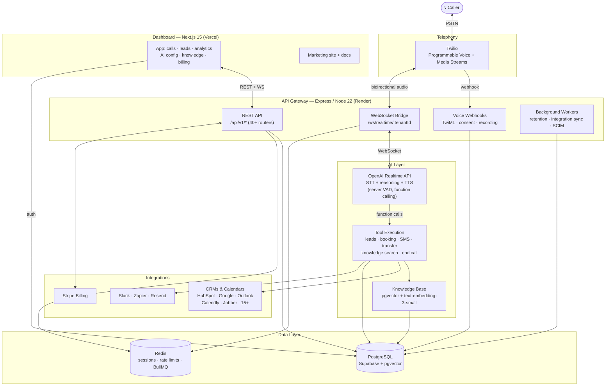
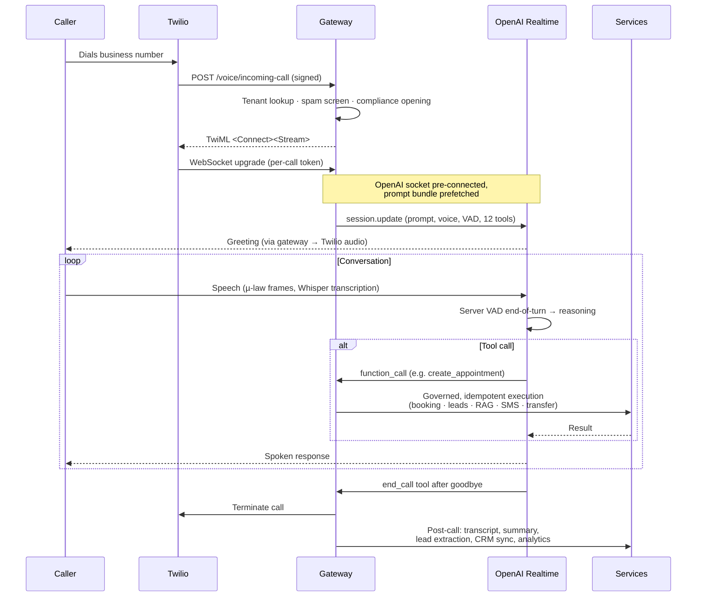

<div align="center">

# 🌙 Halla AI

**The AI voice receptionist platform for the GCC & Middle East — answers every call, books appointments, captures leads, 24/7 — in Arabic and English.**

[](https://www.typescriptlang.org/)
[](https://nodejs.org/)
[](https://nextjs.org/)
[](https://expressjs.com/)
[](https://platform.openai.com/docs/guides/realtime)
[](https://supabase.com/)
[](https://redis.io/)
[](https://www.twilio.com/)
[](https://stripe.com/)
[](https://www.docker.com/)
[](#-license)

[Overview](#-overview) · [Features](#-key-features) · [Architecture](#-architecture) · [Tech Stack](#-technology-stack) · [Getting Started](#-getting-started) · [API](#-api-overview) · [AI Pipeline](#-ai-pipeline) · [Deployment](#-deployment)

**Live:** [www.hallaai.com](https://www.hallaai.com)

</div>

---

## 📖 Overview

**Halla AI** is a production, multi-tenant SaaS platform that gives businesses across the GCC and Middle East an AI receptionist on their existing phone number. When a customer calls, the AI answers in a natural human voice — in Arabic or English — holds a real conversation, answers questions from the business's own knowledge base, captures the lead, books the appointment into the business's calendar, and sends confirmations — with a full transcript and summary landing in the dashboard seconds after hangup.

**The problem it solves:** service businesses (HVAC, plumbing, electrical, legal, property management, salons, and dozens of other verticals) lose revenue every time a call rings out — after hours, during jobs, or at peak demand. Live answering services are expensive and inconsistent. Call IQ answers every call, every time, for a flat monthly subscription.

**Who it's built for:**

- **Service businesses** that can't afford to miss a single inbound call
- **Multi-location operators and MSPs** managing many tenants from one platform
- **Engineers** who want a reference implementation of a real-time voice AI SaaS at production depth

**What makes it different:** most voice-AI demos glue together separate STT → LLM → TTS services with compounding latency. Call IQ bridges Twilio Media Streams directly to the **OpenAI Realtime API** over WebSockets — one bidirectional audio session with native speech understanding, reasoning, function calling, and speech synthesis. Combined with connection pre-warming, prompt prefetching, and server-side voice-activity tuning, the result is conversation that feels immediate rather than transactional. Around that core sits a complete SaaS: metered Stripe billing, 20+ CRM/calendar integrations, compliance tooling (consent capture, recording controls, HIPAA-oriented policies), team management, SSO/SCIM, and a full analytics dashboard.

---

## ✨ Key Features

### 🎙️ Real-Time AI Voice

- Live bidirectional audio between Twilio Media Streams and the OpenAI Realtime API (default model `gpt-realtime`, G.711 µ-law)
- Natural interruption handling via server-side voice activity detection (tunable threshold, prefix padding, and silence window)
- Whisper-based input transcription captured turn-by-turn for transcripts and analytics
- Configurable greeting, agent name, tone, speech rate, and per-tenant voice
- Compliance-aware call opening: AI disclosure, recording announcements, and DTMF consent gates
- Latency engineering throughout: OpenAI socket pre-connect at transport time, session-bundle prefetching, and Redis-backed session state
- Multi-language conversations (English, Spanish, French, Russian, Mandarin, Hindi) with mid-call language switching on eligible plans

### 🏢 Multi-Tenant SaaS

- Tenant-scoped data access enforced at the query layer (`tenant_id` scoping helpers around a shared Postgres pool)
- Organizations, team members, roles, and team notifications
- Per-tenant phone number provisioning and porting workflows
- Plan-gated capabilities (Essential / Professional / Enterprise) with metered minutes, overage billing, and free trials
- MSP and enterprise account structures for managing fleets of tenants

### 🧠 AI Orchestration

- Dynamic system-prompt assembly per tenant: business profile, services, hours, tone, compliance rules, and custom instructions
- Native OpenAI function calling with 12 production tools — lead capture, customer lookup/update, availability checks, appointment create/reschedule/cancel, SMS, call transfer, knowledge search, language switch, and graceful call ending
- Tool idempotency guards to prevent duplicate bookings on retries
- AI governance layer mediating tool execution
- Conversation memory persisted per call; post-call pipeline extracts leads, outcomes, and summaries

### 📚 Knowledge Base (RAG)

- Document and FAQ ingestion into Postgres with `pgvector`
- OpenAI `text-embedding-3-small` embeddings (1536-dim) with cosine-similarity search
- Live `search_knowledge_base` tool lets the AI cite tenant-specific answers mid-call
- Business-hours and service templates editable from the dashboard

### 🔄 CRM, Calendar & Automation

- Native OAuth integrations: HubSpot, Zoho, Clio, Jobber, Slack, Google Calendar, Outlook, Calendly, Acuity, Square Appointments
- Guided API-key integrations: Housecall Pro, Follow Up Boss, Buildium, AppFolio, Yardi, Mindbody, Vagaro, Setmore, and more
- Zapier catch-hook webhooks for 5,000+ additional apps (Salesforce, Copper, ServiceTitan, and others route through Zapier)
- Automated lead sync, appointment booking with post-call fallback, SMS follow-ups (Twilio), and email automation (Resend/SMTP)
- Custom outbound webhooks with delivery logs

### 📊 Dashboard

- Next.js 15 App Router application: calls, transcripts, recordings, leads, appointments, analytics, SMS inbox
- AI configuration studio with live WebSocket preview of prompt/voice changes
- Knowledge base management, integrations hub, compliance center, billing and usage, team and phone-number management
- Full marketing site (pricing, industries, solutions, docs, support with live chat) served from the same app

### 🛡️ Enterprise & Compliance

- SSO and SCIM directory sync
- MFA enforcement middleware, IP allowlists, API keys with scopes, audit logs
- Data-retention policies with automated cleanup workers
- HIPAA-oriented tooling: BAA tracking, consent capture, recording controls
- QA rubrics and call-quality scoring

---

## 🏗 Architecture



---

## 🧩 System Architecture

| Layer | Implementation |
|---|---|
| **Communication** | Twilio Programmable Voice terminates PSTN calls; signed webhooks return TwiML; Media Streams carry bidirectional G.711 µ-law audio over WebSocket to the gateway. Twilio SMS handles text follow-ups. |
| **Voice Pipeline** | `RealtimeGateway` accepts stream upgrades (rate-limited, origin/IP-checked, token-authenticated per call), pre-connects the OpenAI socket at transport time, and bridges audio frames both directions. Session lifecycle is managed by a registry with heartbeats, watchdogs, reconnect grace, and Redis persistence. |
| **AI** | One OpenAI Realtime session per call: server VAD turn-taking, Whisper input transcription, per-tenant system prompt built at connect time, 12 function-calling tools, and a governed tool-execution layer with idempotency. |
| **Business Logic** | 40+ Express routers per domain (leads, appointments, billing, compliance, integrations, IVR, spam screening, onboarding, analytics, …). Post-call processing persists transcripts, extracts leads, computes outcomes, and syncs CRMs. |
| **Data** | Supabase PostgreSQL (63 versioned migrations, pgvector) accessed through a pooled client with tenant-scoped query helpers. Redis backs session state, rate limiting, caching, and BullMQ queues. |
| **Knowledge** | Tenant documents and FAQs embedded via OpenAI and stored in `knowledge_base`; cosine-distance search powers the AI's live `search_knowledge_base` tool. |
| **Integration** | OAuth and API-key connectors under a unified provider registry with encrypted credential storage, connection health logs, and scheduled sync jobs. Stripe webhooks drive subscription lifecycle and metered usage. |
| **Presentation** | Next.js 15 App Router on Vercel: authenticated dashboard (Supabase SSR sessions) plus the full marketing site. A static landing bundle is served in a sandboxed same-origin iframe with its own CSP. |
| **Deployment** | Gateway + Redis on Render (blueprint in `render.yaml`), dashboard on Vercel, database on Supabase. A separate worker process runs retention, integration-sync, and SCIM jobs. Dockerfiles and Compose configs support container-based setups. |

---

## 🛠 Technology Stack

| Category | Technologies |
|---|---|
| **Languages** | TypeScript (end to end), SQL |
| **Frontend** | Next.js 15 (App Router), React 18, Tailwind CSS, Radix UI, Framer Motion, Three.js / React Three Fiber, Recharts |
| **Backend** | Node.js 22, Express 4, `ws` WebSockets, BullMQ, Zod validation |
| **Database** | PostgreSQL (Supabase) with pgvector, node-postgres, Redis |
| **AI** | OpenAI Realtime API (`gpt-realtime`), Whisper transcription, `gpt-4o-mini` (dashboard assistant), `text-embedding-3-small` (RAG) |
| **Voice & Telephony** | Twilio Programmable Voice, Media Streams, SMS, recordings; ElevenLabs (voice cloning, Professional+) |
| **Payments** | Stripe subscriptions, metered overage, webhooks |
| **Cloud** | Render (gateway + Redis), Vercel (dashboard), Supabase (Postgres + Auth) |
| **DevOps** | GitHub Actions CI (migration validation → lint/typecheck → build → test), Docker + Compose, Husky pre-commit hooks |
| **Authentication** | Supabase Auth (dashboard sessions), gateway-issued JWT (HS256, refresh rotation with Redis revocation), scoped API keys, SSO/SCIM, MFA enforcement |
| **Monitoring** | Sentry, OpenTelemetry, Prometheus metrics, Winston structured logging, anomaly detection & self-healing operations modules |
| **Testing** | Vitest (unit/integration/chaos), Playwright (cross-browser E2E + axe accessibility), synthetic caller tests |

---

## 📁 Project Structure

```
call-iq/
├── apps/
│   ├── gateway/              # Express API + Twilio webhooks + realtime voice pipeline
│   │   └── src/
│   │       ├── routes/       # API router registration (40+ domain routers)
│   │       ├── services/     # Domain services: realtime/, voice/, billing/, knowledge/,
│   │       │                 #   integrations/, calendar/, compliance/, sms/, leads/, …
│   │       ├── middleware/   # Auth, tenant resolution, CSRF, MFA, rate limiting
│   │       ├── security/     # JWT, SSRF guard, request hardening, tiered rate limits
│   │       ├── observability/# OTel, tracing, alerts, anomaly detection
│   │       ├── workers/      # Retention, integration-sync, SCIM job definitions
│   │       └── server/       # HTTP server + WebSocket upgrade handling
│   ├── dashboard/            # Next.js 15 customer app + marketing site
│   │   ├── src/app/          # App Router: marketing pages + /dashboard/* app pages
│   │   ├── src/components/   # UI kit, marketing components, dashboard widgets
│   │   ├── src/lib/          # API client, Supabase helpers, integration catalogs
│   │   └── public/           # Static marketing bundle, brand logos, assets
│   ├── worker/               # Standalone background-worker process (imports gateway workers)
│   └── call-iq-videos/       # Remotion compositions for marketing videos (private)
├── packages/
│   ├── types/                # Shared TypeScript contracts
│   ├── db/                   # Lightweight store abstraction
│   ├── memory/               # Conversation summarization / prompt-caching engine
│   └── mcp-client/           # MCP-compliant tool execution client
├── supabase/
│   └── migrations/           # 63 versioned SQL migrations (schema source of truth)
├── e2e/                      # Playwright end-to-end suites (+ stored auth state)
├── tests/                    # Vitest unit / integration / chaos / validation suites
├── scripts/                  # sync-marketing, migration validation, ops tooling
├── docs/                     # Numbered internal documentation set
├── .github/workflows/        # CI, Vercel dashboard checks, realtime prod verification
├── render.yaml               # Render blueprint (gateway service + Redis)
├── docker-compose*.yml       # Local / production container orchestration
└── playwright.config.ts      # Cross-browser E2E configuration
```

---

## 🚀 Getting Started

### Prerequisites

- Node.js **22.x** and npm ≥ 9
- A Supabase project (PostgreSQL + Auth)
- Redis (local Docker or hosted)
- Accounts/keys: OpenAI, Twilio, Stripe (Stripe optional for local voice-only development)

### 1. Clone & install

```bash
git clone https://github.com/mangeshraut712/Call-IQ.git
cd Call-IQ
npm install
```

### 2. Configure environment

Create `apps/gateway/.env` from the example file and fill in your keys (see [Environment Variables](#-environment-variables)). The dashboard reads `apps/dashboard/.env.local` for its Supabase and gateway URLs.

### 3. Database

Apply the SQL migrations in `supabase/migrations/` to your Supabase project (in order), or start from `supabase/schema.sql`. Validate migration integrity any time with:

```bash
npm run validate:migrations
```

### 4. Run everything

```bash
# Redis (if not already running)
npm run redis:up

# Gateway (:3003) + Dashboard (:3000), with marketing sync and health-gated startup
npm run dev
```

Or individually:

```bash
npm run dev:gateway     # Express API + voice pipeline on :3003
npm run dev:dashboard   # Next.js app on :3000
```

### 5. Docker (optional)

```bash
npm run docker:build
npm run docker:up       # docker-compose.yml; production variant available
```

> **Live voice calls** require a publicly reachable gateway for Twilio webhooks — use a tunnel (e.g. ngrok) locally or deploy the gateway, then point your Twilio number's voice webhook at `POST /api/v1/voice/incoming-call`.

---

## 🔐 Environment Variables

Full reference: [`docs/15_ENVIRONMENT_VARIABLES.md`](docs/15_ENVIRONMENT_VARIABLES.md). Key variables:

### Gateway — required

| Variable | Description |
|---|---|
| `NODE_ENV` / `PORT` | Environment and port (default `3003`) |
| `DATABASE_URL` | Supabase pooler connection string (port 6543) |
| `PGSSLMODE` | `require` in production |
| `REDIS_URL` | Redis connection (`rediss://` TLS in production) |
| `JWT_SECRET` | Gateway JWT signing secret (32+ chars) |
| `SUPABASE_URL` / `SUPABASE_SERVICE_ROLE_KEY` | Supabase service access |
| `OPENAI_API_KEY` | Realtime voice, embeddings, assistant |
| `TWILIO_ACCOUNT_SID` / `TWILIO_AUTH_TOKEN` | Telephony + webhook signature validation |
| `STRIPE_SECRET_KEY` / `STRIPE_WEBHOOK_SECRET` | Billing |
| `STRIPE_{PLAN}_PRICE_ID` / `_OVERAGE_ID` | Per-plan price IDs (Essential / Professional / Enterprise) |
| `INTEGRATION_CREDENTIALS_KEY` | 32-byte key encrypting stored integration credentials |

### Gateway — voice tuning (optional)

| Variable | Default | Description |
|---|---|---|
| `OPENAI_REALTIME_MODEL` | `gpt-realtime` | Realtime voice model |
| `OPENAI_MODEL` | `gpt-4o-mini` | Text completions (assistant, summaries) |
| `OPENAI_EMBEDDING_MODEL` | `text-embedding-3-small` | Knowledge-base embeddings |
| `REALTIME_VAD_THRESHOLD` | `0.38` | Voice-activity sensitivity |
| `REALTIME_VAD_SILENCE_MS` | `700` | Silence before the AI takes its turn |
| `REALTIME_VAD_PREFIX_MS` | `320` | Audio padding before detected speech |
| `VOICE_MAX_CALL_DURATION_MS` | `900000` | Hard call cap (15 min) |
| `VOICE_MAX_TENANT_CONCURRENT_CALLS` | `25` | Per-tenant concurrency limit |
| `ELEVENLABS_API_KEY` | — | Voice cloning (Professional+) |
| `DEEPGRAM_API_KEY` | — | STT fallback (not in the primary call path) |

### Gateway — integrations (optional)

OAuth client IDs/secrets for: Google (`GOOGLE_*`), Microsoft (`MS_*`), Calendly, Acuity, Square, HubSpot, Slack, Zoho, Pipedrive, Freshsales, Jobber, Clio, Salesforce. Email via `RESEND_API_KEY` or `SMTP_*`. Observability via `SENTRY_DSN`, `PROMETHEUS_PORT`.

### Dashboard (Vercel)

| Variable | Description |
|---|---|
| `NEXT_PUBLIC_GATEWAY_API_URL` | Gateway base URL |
| `NEXT_PUBLIC_SUPABASE_URL` / `NEXT_PUBLIC_SUPABASE_ANON_KEY` | Supabase client auth |
| `SUPABASE_SERVICE_ROLE_KEY` | Server-side Supabase access |
| `JWT_SECRET` | Shared with gateway |
| `GATEWAY_PROXY_URL` | Local dev: proxy `/api/v1` through Next |

---

## 🌐 API Overview

All REST endpoints are versioned under `/api/v1` and protected by the gateway's auth middleware (JWT / Supabase user / scoped API key) unless explicitly public (webhooks, OAuth callbacks, public plan catalog). Highlights:

| Domain | Prefix | Purpose |
|---|---|---|
| **Voice** | `/voice` | Twilio webhooks: incoming call TwiML, stream status, recording status, DTMF consent |
| **Calls** | `/calls`, `/recordings` | Call history, transcripts, recordings |
| **Leads** | `/leads` | Lead CRUD, activities, routing rules |
| **Appointments** | `/appointments`, `/calendar`, `/business-hours` | Booking, availability, calendar provider OAuth |
| **Knowledge** | `/knowledge` | Documents, FAQ items, templates, semantic search |
| **AI Config** | `/ai-config`, `/ivr` | Agent persona, prompts, greetings, IVR flows |
| **Dashboard** | `/dashboard`, `/analytics`, `/reports`, `/search` | Metrics, SSE updates, scheduled reports |
| **Billing** | `/billing`, `/cost`, `/billing-intelligence` | Plans, subscriptions, usage, invoices, Stripe webhook |
| **Integrations** | `/integrations`, `/slack`, `/webhooks`, `/automation` | OAuth flows, provider config, sync, custom webhooks |
| **Team & Auth** | `/team`, `/api-keys`, `/sso`, `/audit-logs`, `/ip-allowlist` | Members, keys, SSO/SCIM, audit trail |
| **Compliance** | `/compliance`, `/compliance/center`, `/retention`, `/spam` | Consent, recording policy, retention, spam screening |
| **Platform** | `/tenants`, `/onboarding`, `/phone-numbers`, `/msp`, `/qa`, `/operations`, `/feature-flags` | Tenant lifecycle, provisioning, QA scoring, ops |
| **Health** | `/health`, `/ready`, `/stats` | Liveness, readiness (Render health check), runtime stats |

**WebSockets:** `/ws/realtime/{tenantId}` (Twilio media bridge) and `/ws/ai-config/` (live config push to the dashboard).

---

## 🤖 AI Pipeline



Every stage is instrumented: session lifecycle telemetry, audio diagnostics, first-audio latency tracking, and per-call cost accounting.

---

## 🗄 Database

Schema lives in **63 versioned migrations** (`supabase/migrations/`) on Supabase PostgreSQL with `pgvector`. Major table groups:

| Group | Tables (selection) |
|---|---|
| **Tenancy** | `voice_tenants`, `organizations`, `org_members`, `enterprise_accounts`, `msp_tenants` |
| **Calls** | `calls`, `call_costs`, `call_quality_scores`, `call_evaluations`, `call_spam_log`, `customers` |
| **Leads & Booking** | `leads`, `lead_activities`, `lead_routing_rules`, `appointments`, `calendar_events`, `calendar_connections` |
| **Knowledge** | `knowledge_base` (vector embeddings), `knowledge_base_items`, `knowledge_files` |
| **Billing** | `subscriptions`, `invoices`, `usage_records`, `minutes_accounting`, `billing_warnings` |
| **AI Config** | `ai_configs`, `ai_agents`, `ai_prompt_templates`, `ai_performance_metrics` |
| **Integrations** | `integration_connections`, `integration_logs`, `integration_oauth_states`, `integration_sync_jobs`, `slack_connections` |
| **Telephony & SMS** | `tenant_phone_numbers`, `phone_port_requests`, `sms_conversations`, `sms_messages`, `ivr_flows`, `business_hours` |
| **Team & Auth** | `team_members`, `tenant_api_keys`, `sso_configs`, `scim_directory_users`, `enterprise_audit_events` |
| **Compliance** | `compliance_settings`, `audit_logs`, `data_retention_policies`, `baa_agreements`, `ip_allowlist` |
| **Analytics & Ops** | `daily_metrics`, `webhook_deliveries`, `automation_rules`, `scheduled_reports`, `tenant_feature_flags` |

---

## 🔌 Integrations

| Service | Role |
|---|---|
| **OpenAI** | Realtime voice sessions, Whisper transcription, embeddings, dashboard assistant |
| **Twilio** | PSTN voice, Media Streams, SMS, call recording, number provisioning |
| **Stripe** | Subscriptions, metered overage, invoices, webhooks |
| **Supabase** | PostgreSQL, Auth (dashboard sessions), service-role server access |
| **Redis** | Session state, rate limiting, caching, BullMQ job queues |
| **Google Calendar / Outlook** | Native two-way calendar sync (OAuth) |
| **Calendly / Acuity / Square Appointments** | Scheduling providers (OAuth, Calendly webhooks) |
| **HubSpot / Zoho / Pipedrive / Freshsales / Insightly** | CRM lead sync |
| **Clio / MyCase** | Legal practice management |
| **Jobber / Housecall Pro** | Field-service platforms (ServiceTitan via Zapier) |
| **Buildium / AppFolio / Yardi** | Property management |
| **Follow Up Boss / Mindbody / Vagaro / Setmore** | Vertical CRMs & booking |
| **Slack** | Call/lead/appointment notifications (OAuth) |
| **Zapier** | Catch-hook automation for 5,000+ additional apps |
| **Resend / SMTP** | Transactional and automation email |
| **ElevenLabs** | Custom voice cloning (Professional+) |
| **Tawk.to** | Live chat on the marketing site |
| **Sentry / OpenTelemetry / Prometheus** | Errors, tracing, metrics |

---

## 🔒 Security

- **Authentication** — layered model: Supabase session cookies for the dashboard, gateway-issued HS256 JWTs (short-lived access + Redis-revocable refresh tokens) for API access, scoped API keys for programmatic use, and internal service keys for trusted paths.
- **Authorization** — per-route public allowlist (webhooks/OAuth only); everything else requires an authenticated tenant context. API-key scopes and MFA enforcement middleware gate sensitive operations.
- **Tenant isolation** — tenant-scoped query helpers append `tenant_id` predicates at the data layer; per-call stream tokens bind WebSocket sessions to a verified call SID and tenant.
- **Webhook integrity** — Twilio signature validation, Stripe signing secrets, and Calendly HMAC verification on every inbound webhook.
- **Secrets** — no secrets in the repo; integration credentials encrypted at rest with a dedicated 32-byte key; Render/Vercel-managed environment variables.
- **Validation & hardening** — Zod schema validation at boundaries, CSRF protection, SSRF guard, security headers, HTTPS redirect, strict CORS allowlist (no wildcard in production).
- **Rate limiting** — tiered HTTP limits, separate webhook and public-endpoint limiters, and WebSocket-layer IP/burst/reconnect/tenant limits.
- **Frontend** — strict CSP with distinct policies for the app (`frame-ancestors 'none'`) and the sandboxed marketing iframe, plus `nosniff`, referrer, and permissions policies.

---

## ☁️ Deployment

**Production topology** (as deployed for hallaai.com):

| Component | Platform | Notes |
|---|---|---|
| Gateway | Render web service | `render.yaml` blueprint; health-checked at `/ready`; auto-deploy on `main` |
| Redis | Render Redis | `noeviction` policy; TLS |
| Dashboard | Vercel | Next.js; `/api/v1` proxied same-origin to the gateway; WS direct to Render |
| Database | Supabase | Pooler connection (port 6543), `pgvector` enabled |
| Workers | Separate process (`apps/worker`) | Retention, integration sync, SCIM; can co-locate via `GATEWAY_RUN_WORKERS=true` |
| Telephony | Twilio | Number webhooks → gateway public URL |

**Scaling characteristics:** per-tenant and global concurrent-call limits, Redis-backed session coordination for reconnects, queue-based background work (BullMQ), and stateless HTTP handlers. Docker Compose configurations (`docker-compose.yml`, `docker-compose.production.yml`) and an `nginx/` reverse-proxy setup support self-hosted deployments.

---

## 📈 Monitoring & Observability

- **Logging** — structured Winston JSON logs with request IDs and correlation context patched per call/session
- **Health** — `/health` (liveness) and `/ready` (readiness, used by Render) plus `/stats` runtime metrics
- **Metrics** — Prometheus endpoint; per-call cost accounting; first-audio latency and session-bundle timing logs
- **Tracing** — OpenTelemetry bootstrap with distributed tracing across the voice pipeline
- **Errors** — Sentry (with profiling) on the gateway; global error boundaries in the dashboard
- **Operations** — anomaly detection, tenant-health scoring, alert routing, and self-healing/auto-recovery modules under `src/intelligence/` and `src/operations/`

---

## 👩‍💻 Development Workflow

```bash
npm run dev            # Gateway + dashboard with marketing sync and health-gated startup
npm run lint           # ESLint across all workspaces (zero-warning policy on apps)
npm run typecheck      # Strict TypeScript across all workspaces
npm run test           # Vitest unit/integration suites
npm run test:e2e       # Playwright E2E (Chromium, WebKit, Firefox + axe a11y)
npm run validate       # Migrations + typecheck + lint + tests (CI parity)
```

- **Pre-commit** (Husky): `lint` + `typecheck` must pass before any commit lands
- **CI** (GitHub Actions): migration validation → lint/typecheck → build → test on every push/PR
- **Migrations**: additive, numbered SQL files validated by `scripts/validate-migrations.mjs`
- **Marketing site**: edit the root `index.html`/`calliq_styles.css` sources, then `npm run sync:marketing` to publish into the dashboard

---

## 🗺 Roadmap

**Shipped**

- [x] Real-time voice agent on the OpenAI Realtime API with 12-tool function calling
- [x] Multi-tenant SaaS with Stripe metered billing and free trials
- [x] pgvector knowledge base with live in-call retrieval
- [x] 20+ CRM/calendar integrations + Zapier
- [x] Compliance center: AI disclosure, consent capture, recording controls, retention policies
- [x] SSO/SCIM, MFA enforcement, audit logs, scoped API keys
- [x] Cross-browser E2E suite and production verification workflows

**In progress**

- [ ] Voice cloning rollout (ElevenLabs — service layer present, Professional+ gated)
- [ ] IVR flow builder (API present; dashboard UX expanding)
- [ ] Billing intelligence and cost-anomaly alerts

**Planned**

- [ ] Outbound campaign calling (schema groundwork in place)
- [ ] Deeper MSP/white-label tooling
- [ ] Additional languages and regional voice options

---

## 🖼 Screenshots

> Screenshots are being prepared. Placeholders below map to real dashboard pages.

| Page | Preview |
|---|---|
| Dashboard overview | `docs/screenshots/dashboard.png` *(coming soon)* |
| Analytics | `docs/screenshots/analytics.png` *(coming soon)* |
| Call history & transcripts | `docs/screenshots/calls.png` *(coming soon)* |
| Knowledge base | `docs/screenshots/knowledge.png` *(coming soon)* |
| AI configuration studio | `docs/screenshots/ai-config.png` *(coming soon)* |
| Live voice flow | `docs/screenshots/voice-flow.png` *(coming soon)* |

---

## 📄 License

MIT — declared in [`package.json`](package.json). (A standalone `LICENSE` file is pending; the `apps/call-iq-videos` workspace is private/unlicensed.)

---

## 🤝 Contributing

1. **Fork & branch** — create a feature branch from `main` (`feat/…`, `fix/…`)
2. **Develop** — `npm run dev`; keep changes scoped and typed
3. **Verify** — `npm run precommit` locally (lint + typecheck); add Vitest/Playwright coverage for behavior changes
4. **Migrations** — new schema changes go in a new numbered file under `supabase/migrations/`; never edit applied migrations
5. **Pull request** — clear description of the what and why; CI must be green

Please report security issues privately rather than via public issues.

---

## 🙏 Acknowledgements

Built on the shoulders of: [OpenAI](https://platform.openai.com/) (Realtime API, Whisper, embeddings) · [Twilio](https://www.twilio.com/) (voice + SMS) · [Supabase](https://supabase.com/) (Postgres + Auth) · [Stripe](https://stripe.com/) (billing) · [Next.js](https://nextjs.org/) & [Vercel](https://vercel.com/) · [Render](https://render.com/) · [Redis](https://redis.io/) & [BullMQ](https://bullmq.io/) · [Radix UI](https://www.radix-ui.com/) & [Tailwind CSS](https://tailwindcss.com/) · [Playwright](https://playwright.dev/) & [Vitest](https://vitest.dev/) · [Sentry](https://sentry.io/) & [OpenTelemetry](https://opentelemetry.io/).

<div align="center">

**Call IQ** — never miss a call again.

</div>
