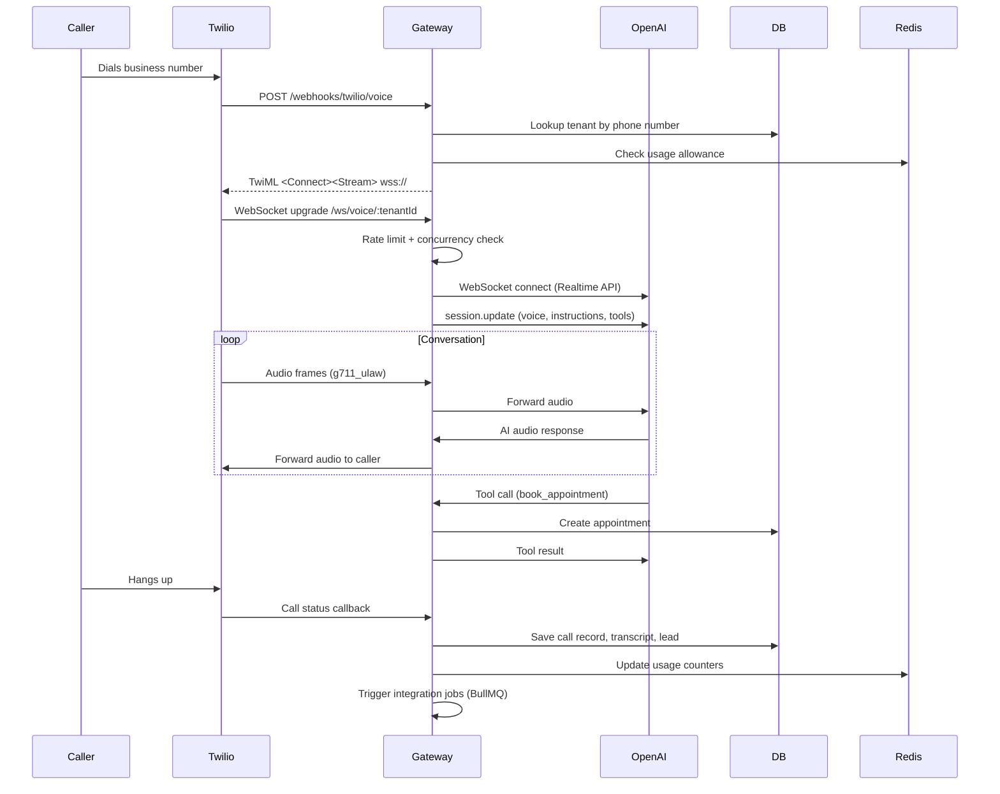

# 02 — SYSTEM ARCHITECTURE

## Monorepo Structure

**Workspace manager:** npm workspaces  
**Root:** `package.json` with `"workspaces": ["apps/*", "packages/*"]`

### Apps

| App | Path | Runtime | Purpose |
|-----|------|---------|---------|
| Gateway | `apps/gateway/` | Node.js + Express | Voice API, WebSocket, all backend services |
| Dashboard | `apps/dashboard/` | Next.js 15 | Marketing site + tenant dashboard (Vercel) |

### Packages

| Package | Path | Purpose |
|---------|------|---------|
| @call-iq/types | `packages/types/` | Shared TypeScript interfaces |
| @call-iq/db | `packages/db/` | Database utilities |
| @call-iq/memory | `packages/memory/` | Conversation memory management |
| @call-iq/mcp-client | `packages/mcp-client/` | MCP protocol client |

## Gateway Service Map

The gateway (`apps/gateway/src/services/`) contains 32 service directories + 30 standalone service files:

### Core Services (Directories)

| Service | Path | Purpose |
|---------|------|---------|
| voice | `services/voice/` | Twilio WebSocket, AI service, TTS/STT, call sessions |
| realtime | `services/realtime/` | OpenAI Realtime API gateway, session management |
| billing | `services/billing/` | Stripe, subscriptions, usage, trials, overage |
| knowledge | `services/knowledge/` | Vector embeddings, file upload, RAG retrieval |
| ai-config | `services/ai-config/` | Per-tenant AI personality configuration |
| integrations | `services/integrations/` | CRM providers, BullMQ job queue |
| calendar | `services/calendar/` | Google, Outlook, Calendly, Acuity |
| analytics | `services/analytics/` | Call metrics, performance tracking |
| leads | `services/leads/` | Lead capture and management |
| appointments | `services/appointments/` | Appointment booking |
| team | `services/team/` | Team member management |
| sms | `services/sms/` | SMS messaging via Twilio |
| automation | `services/automation/` | Workflow automation |
| business-hours | `services/business-hours/` | Operating hours configuration |
| phone-provisioning | `services/phone-provisioning/` | Twilio number purchase/release |
| recordings | `services/recordings/` | Call recording management |
| slack | `services/slack/` | Slack notifications |
| webhooks | `services/webhooks/` | Custom webhook management |
| api-keys | `services/api-keys/` | Tenant API key management |
| audit | `services/audit/` | Audit logging |
| sso | `services/sso/` | SSO/SAML configuration |
| ivr | `services/ivr/` | IVR flow builder |
| qa | `services/qa/` | Quality assurance rubrics |
| data-retention | `services/data-retention/` | Data lifecycle policies |
| scheduled-reports | `services/scheduled-reports/` | Automated email reports |
| msp | `services/msp/` | Reseller/MSP management |
| security | `services/security/` | IP allowlist, guardrails |
| voice-cloning | `services/voice-cloning/` | ElevenLabs voice cloning |
| onboarding | `services/onboarding/` | Tenant onboarding flow |
| industry | `services/industry/` | Industry-specific templates |
| dashboard | `services/dashboard/` | Dashboard data aggregation |
| workflows | `services/workflows/` | Event bus, workflow engine |

### Standalone Services

| File | Purpose |
|------|---------|
| `cache.ts` | Redis cache manager (CacheManager class) |
| `logger.ts` | Winston-based structured logging |
| `health-check.ts` | Health check service with dependency checks |
| `graceful-shutdown.ts` | Service registry for clean shutdown |
| `env.ts` | Environment variable validation |
| `ws-rate-limiter.ts` | WebSocket rate limiting (IP, burst, tenant) |
| `circuit-breaker.ts` | Circuit breaker pattern |
| `rate-limiter.ts` | HTTP rate limiting |
| `jwt-rotation.ts` | JWT secret rotation |
| `api-key-rotation.ts` | API key rotation |
| `tracing.ts` | Distributed tracing |
| `tenant-provisioning.ts` | Tenant creation automation |
| `tenant-policy-engine.ts` | Feature flag enforcement |
| `alert-routing.ts` | Alert routing to Slack/email |
| `anomaly-detection.ts` | Metric anomaly detection |
| `incident-response.ts` | Incident management |
| `operational-health-scoring.ts` | System health scoring |
| `cost-tracking.ts` | Infrastructure cost tracking |
| `deployment-safety.ts` | Deployment safety checks |
| `deployment-governance.ts` | Deployment approval workflow |

## Data Flow — Inbound Call

## WebSocket Endpoints

| Path | Purpose | Handler |
|------|---------|---------|
| `/ws/voice/:tenantId` | Twilio Media Streams | VoiceWebSocketServer |
| `/ws/realtime/:tenantId` | OpenAI Realtime bridge | RealtimeGateway |
| `/ws/test` | Connectivity testing | VoiceWebSocketServer (echo) |

## Request Lifecycle (HTTP)

1. Request hits Express
2. Security middleware (helmet, CORS, security headers)
3. Compression middleware
4. Request ID assignment
5. JSON body parsing (10MB limit)
6. Rate limiting (`/api/` routes)
7. IP allowlist check
8. Route handler
9. 404 handler (if no match)
10. Error handler (catches all)

## Scaling Architecture

- **Horizontal:** Render auto-scales web service instances
- **Concurrency guard:** Per-tenant max concurrent calls (default 25)
- **Global limit:** Max 300 concurrent calls system-wide
- **Redis:** Shared state for multi-instance coordination
- **BullMQ:** Background job processing for integrations
- **Database pooling:** Supabase PgBouncer (port 6543)
